# Tech-Blog

My task is to build a CMS-style blog site similar to a Wordpress site, where developers can publish their blog posts and comment on other developers’ posts as well. I’ll build this site completely from scratch and deploy it to Heroku. My app will follow the MVC paradigm in its architectural structure, using Handlebars.js as the templating language, Sequelize as the ORM, and the express-session npm package for authentication.

## Functions

- When I visit the site for the first time, I am presented with the homepage, which includes existing blog posts if any have been posted; navigation links for the homepage and the dashboard; and the option to log in.
- When I click on the homepage option, I am taken to the homepage.
- When I click on any other links in the navigation, I am prompted to either sign up or sign in.
- When I choose to sign up, I am prompted to create a username and password.
- When I click on the sign-up button, my user credentials are saved and I am logged into the site.
- When I revisit the site at a later time and choose to login, I am prompted to enter my username and password.
- When I am signed in to the site, I see navigation links for the homepage, the dashboard, and the option to log out.
- When I click on the homepage option in the navigation, I am taken to the homepage and presented with existing blog posts that include the post title and the date created.
- When I click on an existing blog post, I am presented with the post title, contents, post creator’s username, and date created for that post and have the option to leave a comment.
- When I enter a comment and click on the submit button while signed in, the comment is saved and the post is updated to display the comment, the comment creator’s username, and the date created.
- When I click on the dashboard option in the navigation, I am taken to the dashboard and presented with any blog posts I have already created and the option to add a new blog post.
- When I click on the button to add a new blog post, I am prompted to enter both a title and contents for my blog post.
- When I click on the button to create a new blog post, the title and contents of my post are saved and I am taken back to an updated dashboard with my new blog post.
- When I click on one of my existing posts in the dashboard, I am able to delete or update my post and taken back to an updated dashboard.
- When I click on the logout option in the navigation, I am signed out of the site.
- When I am idle on the site for more than a set time, I am able to view posts and comments but I am prompted to log in again before I can add, update, or delete posts

## Installation

- Go to an empty folder and type 'git clone https://github.com/cckinwest/Week14-TechBlog.git' in the terminal to pull all the folders and files of the app.
- Type 'npm i' to install all packages required.
- Type 'nodemon server.js' to run the app server.
- Go to explorer and type in the address 'http://localhost:3001' to run the app.

## Signup/login

When choose to sign up, the user is prompted to create a username and password. When I revisit the site at a later time and choose to login, I am prompted to enter my username and password.

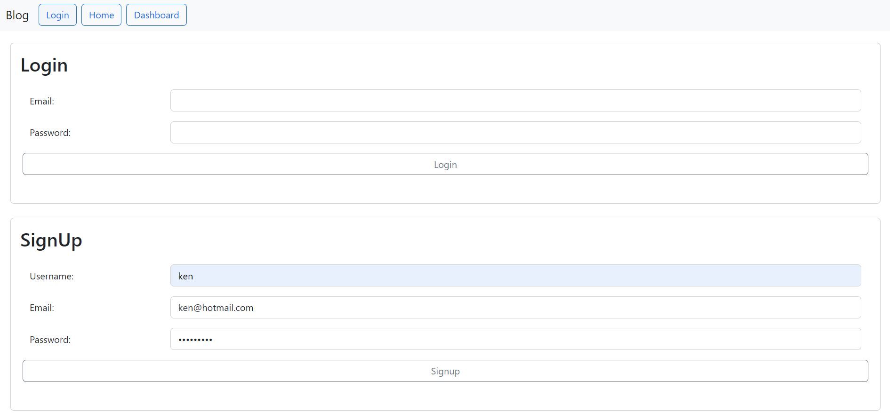

## Homepage

User can get to the homepage before signin / login. However, they can only view the title of posts on the homepage.

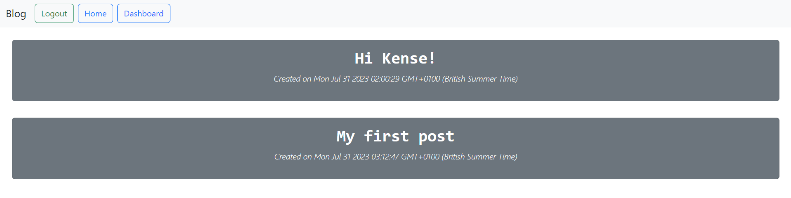

After signin / login, user can click into the post to view and comment.

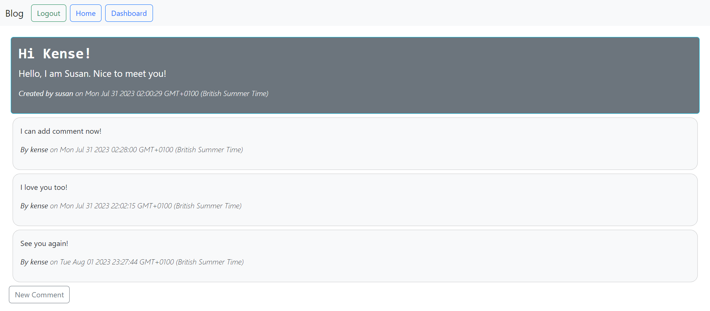

Pressing the 'New Comment' button, a textarea pops out and user can type the comment.

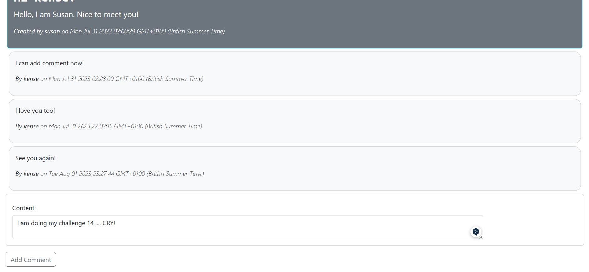

After clicking 'Add Comment', the comment is added.

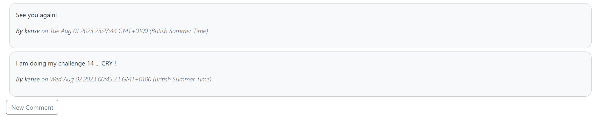

## Dashboard

Users can also go to the dashboard to add / update / delete their posts after signup / login.

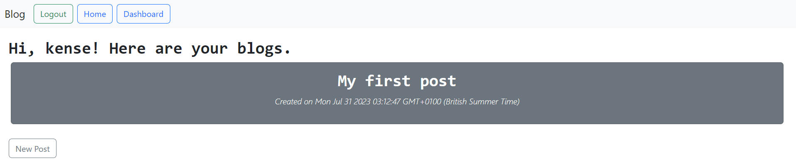

Click the 'New Post' to add post.

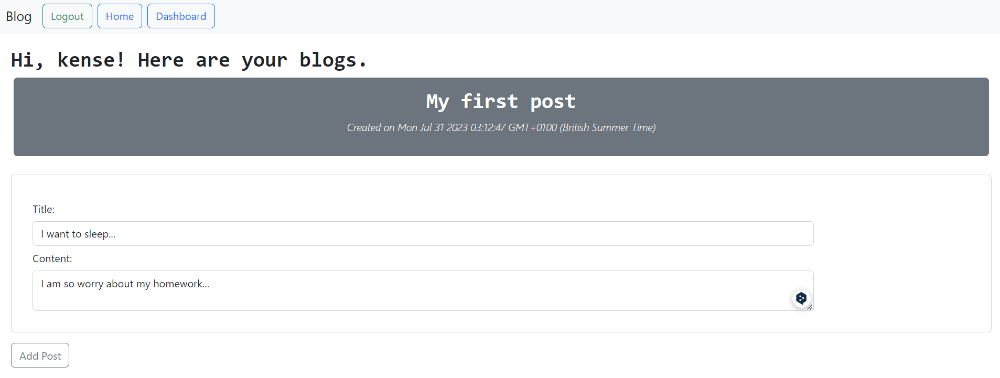
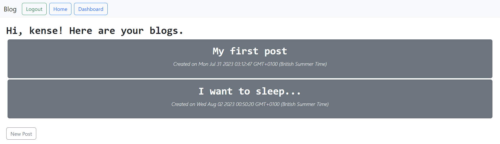

Click into any of your posts, you can find options to update and delete.

To update, click 'Update'
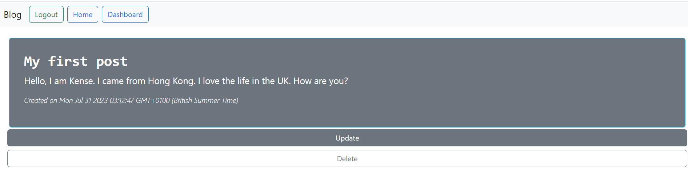

Then make the change.
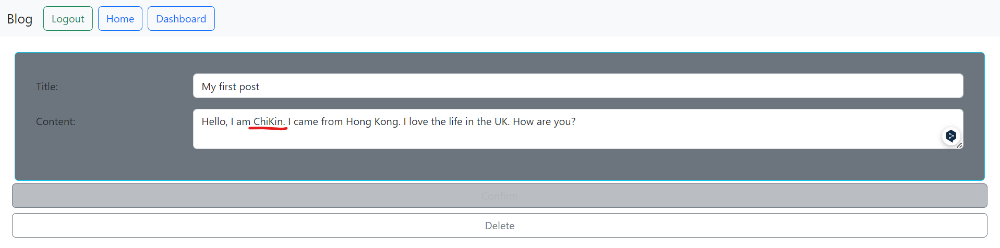

Finally confirm and the change is made.
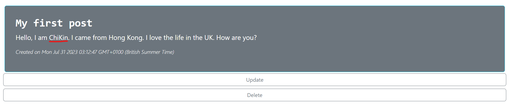

To delete, click 'delete' and the post will disappear.
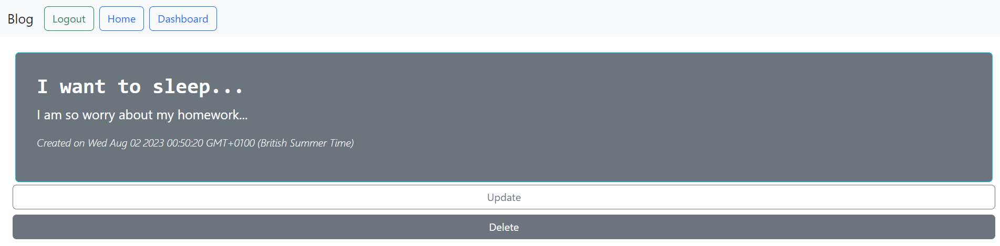

## Handle of Timeout

When the page is idle for a long time, user is blocked from making comments, or update / delete post:

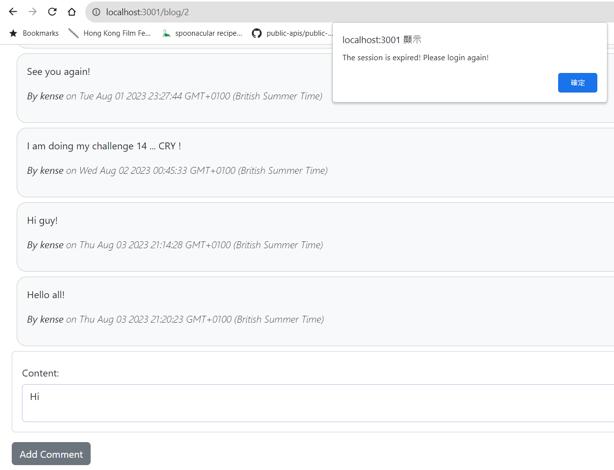

## Deployment

- Github Link: [TechBlog](https://github.com/cckinwest/Week14-TechBlog)
- Heroku: [TechBlog-webpage](https://week14-techblog-app-e3396b82dfd7.herokuapp.com/)
